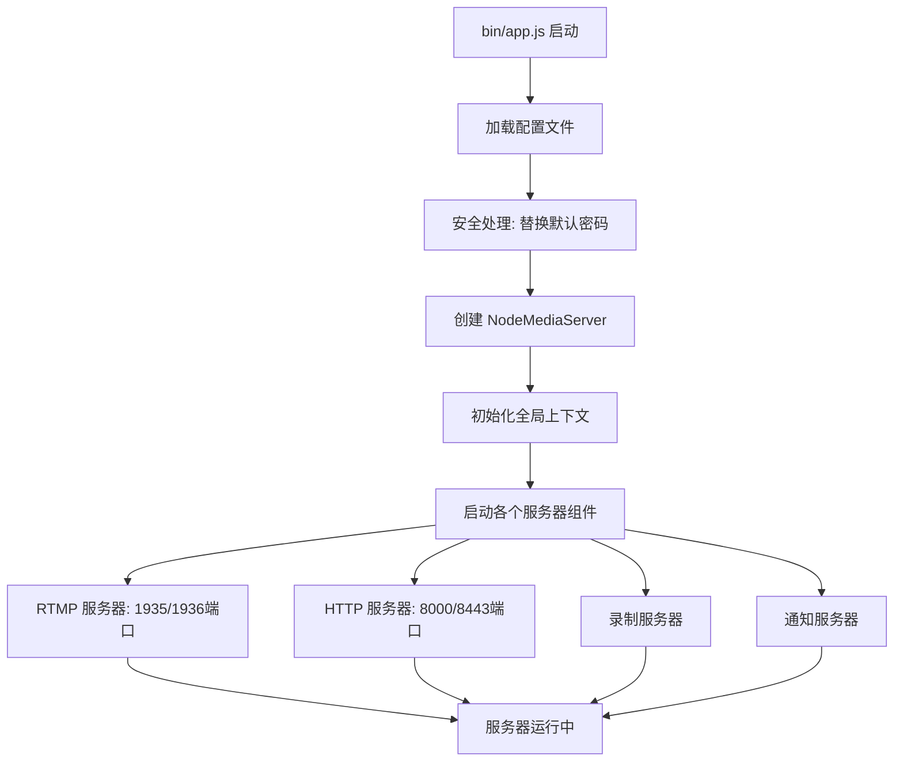
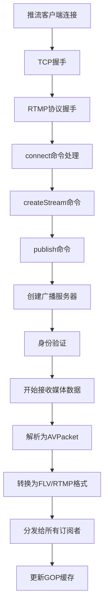
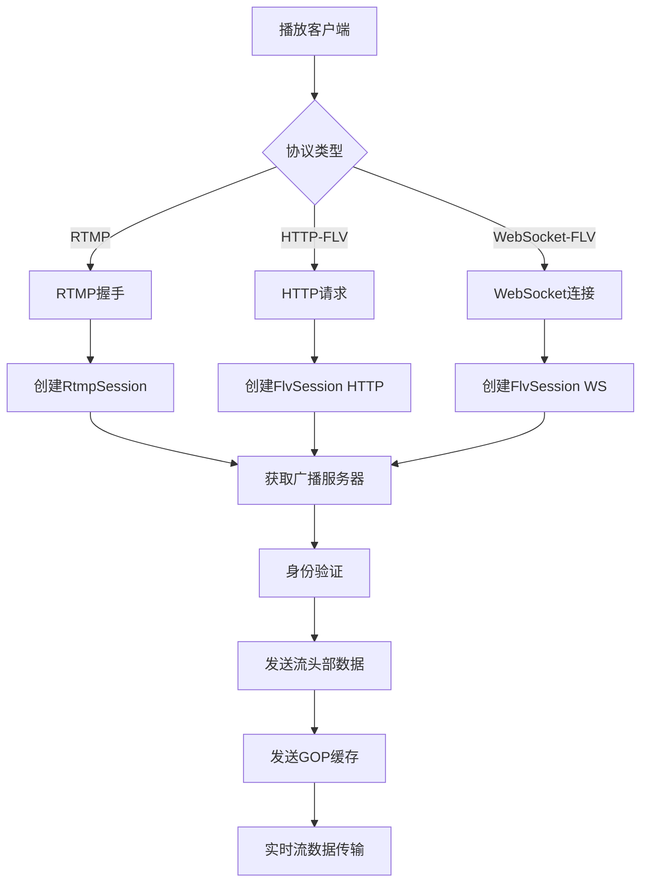
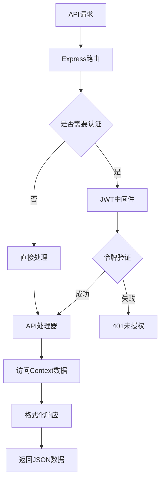

# Node-Media-Server 架构总览

## 项目简介

Node-Media-Server 是一个高性能的 Node.js 实时流媒体服务器，支持多种流媒体协议和现代编解码器。本文档详细分析了整个项目的架构、工作流程和各个组件之间的关系。

## 核心架构

### 1. 系统层次结构

```
┌─────────────────────────────────────────────────────────────┐
│                    应用层 (Application Layer)                │
├─────────────────┬─────────────────┬─────────────────────────┤
│   RTMP推流/播放  │   HTTP-FLV播放   │    WebSocket-FLV播放     │
│   (OBS/FFmpeg)  │   (Web播放器)   │      (Web播放器)        │
└─────────────────┴─────────────────┴─────────────────────────┘
┌─────────────────────────────────────────────────────────────┐
│                    协议层 (Protocol Layer)                   │
├─────────────────┬─────────────────┬─────────────────────────┤
│   RTMP协议      │    FLV协议      │      WebSocket协议      │
│   (握手/分块)    │   (标签格式)    │        (帧格式)         │
└─────────────────┴─────────────────┴─────────────────────────┘
┌─────────────────────────────────────────────────────────────┐
│                   会话层 (Session Layer)                     │
├─────────────────┬─────────────────┬─────────────────────────┤
│   RTMP Session  │   FLV Session   │      API Session        │
│   (推流/播放)    │  (HTTP/WS播放)  │      (REST API)         │
└─────────────────┴─────────────────┴─────────────────────────┘
┌─────────────────────────────────────────────────────────────┐
│                    服务层 (Service Layer)                    │
├─────────────────┬─────────────────┬─────────────────────────┤
│   RTMP Server   │  HTTP Server    │     Broadcast Server    │
│   (TCP监听)      │  (HTTP/WS监听)  │      (流分发)           │
└─────────────────┴─────────────────┴─────────────────────────┘
┌─────────────────────────────────────────────────────────────┐
│                    核心层 (Core Layer)                       │
├─────────────────┬─────────────────┬─────────────────────────┤
│     Context     │   Logger        │     Event System        │
│   (全局状态)     │   (日志系统)    │      (事件管理)         │
└─────────────────┴─────────────────┴─────────────────────────┘
```

### 2. 主要组件说明

#### 2.1 核心组件 (Core Components)

**Context (`src/core/context.js`)**
- 全局共享状态管理器
- 管理活跃会话 (sessions)
- 管理广播流 (broadcasts)
- 事件发射器 (eventEmitter)

**Logger (`src/core/logger.js`)**
- 统一日志记录系统
- 支持不同日志级别
- 结构化日志输出

**AVPacket (`src/core/avpacket.js`)**
- 音视频数据包抽象
- 统一媒体数据格式
- 支持多种编解码器

#### 2.2 服务器组件 (Server Components)

**NodeRtmpServer (`src/server/rtmp_server.js`)**
- RTMP/RTMPS 服务器实现
- TCP/SSL 连接处理
- 支持标准1935端口和安全1936端口

**NodeHttpServer (`src/server/http_server.js`)**
- HTTP/HTTPS 服务器
- 静态文件服务
- API 接口服务
- WebSocket 支持

**NodeRecordServer (`src/server/record_server.js`)**
- 流录制功能
- 支持多种录制格式
- 自动分段录制

**NodeNotifyServer (`src/server/notify_server.js`)**
- 推送通知系统
- 支持HTTP回调
- 事件通知机制

#### 2.3 会话组件 (Session Components)

**BaseSession (`src/session/base_session.js`)**
- 抽象会话基类
- 通用会话属性和方法
- 会话生命周期管理

**RtmpSession (`src/session/rtmp_session.js`)**
- RTMP协议会话实现
- 推流和播放会话处理
- RTMP协议状态管理

**FlvSession (`src/session/flv_session.js`)**
- FLV协议会话实现
- HTTP和WebSocket支持
- FLV流数据处理

#### 2.4 协议组件 (Protocol Components)

**Rtmp (`src/protocol/rtmp.js`)**
- RTMP协议完整实现
- 握手、分块、消息处理
- 支持增强RTMP FLV v1

**Flv (`src/protocol/flv.js`)**
- FLV格式处理
- 标签解析和生成
- 现代编解码器支持

**Amf (`src/protocol/amf.js`)**
- Action Message Format
- 元数据序列化/反序列化
- 与Flash兼容的数据格式

## 工作流程

### 1. 服务器启动流程



### 2. RTMP推流流程



### 3. 多协议播放流程



### 4. API请求处理流程



## 关键特性

### 1. 多协议支持
- **RTMP/RTMPS**: 标准推流协议，支持SSL加密
- **HTTP-FLV**: HTTP长连接播放，低延迟
- **WebSocket-FLV**: WebSocket播放，更好的浏览器兼容性

### 2. 现代编解码器支持
- **视频**: H.264, H.265/HEVC, VP9, AV1
- **音频**: AAC, MP3, Opus
- **增强RTMP FLV v1**: 原生支持现代编解码器

### 3. 安全特性
- **HMAC-SHA256握手**: 安全的RTMP握手验证
- **TLS/SSL支持**: HTTPS、RTMPS加密传输
- **JWT认证**: REST API访问控制
- **流认证**: MD5签名的推流/播放认证

### 4. 监控和管理
- **REST API**: 完整的流管理接口
- **实时统计**: 会话、流、系统性能监控
- **事件系统**: 全生命周期事件通知
- **日志系统**: 结构化日志记录

### 5. 高性能设计
- **事件驱动**: 基于Node.js事件循环
- **内存优化**: GOP缓存管理，防止内存泄漏
- **并发处理**: 支持大量并发连接
- **协议转换**: 实时格式转换，低延迟

## 配置系统

### 配置文件结构 (`bin/config.json`)

```json
{
  "rtmp": {
    "port": 1935,
    "rtmps": {
      "port": 1936,
      "key": "server.key",
      "cert": "server.crt"
    }
  },
  "http": {
    "port": 8000,
    "https": {
      "port": 8443,
      "key": "server.key",
      "cert": "server.crt"
    }
  },
  "auth": {
    "play": true,
    "publish": true,
    "secret": "your-secret-key"
  },
  "jwt": {
    "users": [
      {"username": "admin", "password": "admin", "role": "admin"}
    ]
  }
}
```

## 事件系统

### 生命周期事件
- `preConnect`: 连接建立前
- `postConnect`: 连接建立后
- `prePublish`: 推流开始前
- `postPublish`: 推流开始后
- `prePlay`: 播放开始前
- `postPlay`: 播放开始后
- `donePublish`: 推流结束
- `donePlay`: 播放结束

### 事件使用示例
```javascript
nms.on('prePublish', (session) => {
  console.log(`Stream ${session.streamPath} starting to publish`);
});

nms.on('donePlay', (session) => {
  console.log(`Player ${session.id} stopped playing`);
});
```

## 性能优化

### 1. 内存管理
- GOP缓存大小限制 (4096帧)
- 会话及时清理
- 流数据自动释放

### 2. 网络优化
- TCP_NODELAY启用
- 缓冲区大小优化
- 零拷贝数据传输

### 3. 编解码优化
- 硬件编码支持
- 快速格式转换
- 延迟优化算法

这个架构设计确保了Node-Media-Server能够高效处理大规模实时流媒体需求，同时保持良好的可扩展性和维护性。