# Node-Media-Server 数据流分析

## 数据流架构总览

Node-Media-Server 采用了分层的数据流架构，确保了高效的媒体数据处理和多协议兼容性。整个数据流从推流端到播放端经历了多个处理阶段。

## 核心数据结构

### 1. AVPacket - 统一媒体数据包

AVPacket 是整个系统中最核心的数据结构，用于在不同组件间传递音视频数据：

```javascript
class AVPacket {
  constructor() {
    this.codec_type = 0;     // 编码器类型: 8=音频, 9=视频, 18=脚本
    this.codec_id = 0;       // 编码器ID
    this.pts = 0;           // 显示时间戳
    this.dts = 0;           // 解码时间戳
    this.size = 0;          // 数据大小
    this.flags = 0;         // 标志位: 1=音频头, 2=视频头, 3=关键帧, 4=普通帧, 5=元数据
    this.data = Buffer.alloc(0); // 原始媒体数据
  }
}
```

### 2. Session - 会话数据结构

```javascript
class BaseSession {
  constructor() {
    this.id = '';              // 唯一会话ID
    this.ip = '';              // 客户端IP地址
    this.protocol = '';        // 协议类型: "rtmp", "flv"
    this.streamApp = '';       // 应用名称
    this.streamName = '';      // 流名称
    this.streamPath = '';      // 完整流路径
    this.isPublisher = false;  // 是否为发布者
    this.inBytes = 0;          // 输入字节数
    this.outBytes = 0;         // 输出字节数
    this.createTime = 0;       // 创建时间
    this.endTime = 0;          // 结束时间
  }
}
```

## 推流数据流分析

### 1. RTMP推流数据流

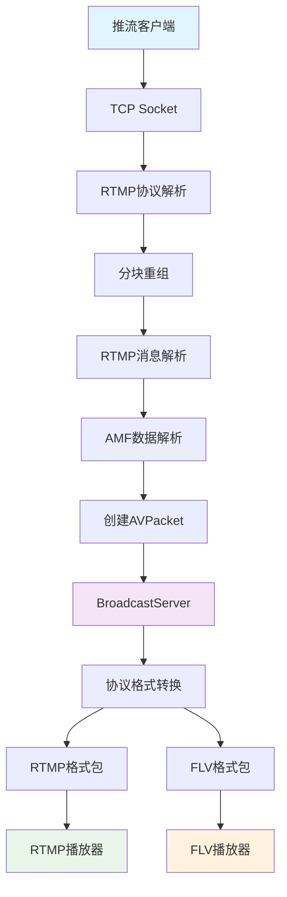

#### 详细数据转换过程：

**步骤1: RTMP消息到AVPacket**
```javascript
// RTMP Protocol处理
static parserTag(type, time, size, data) {
  let packet = new AVPacket();
  packet.codec_type = type;
  packet.pts = time;
  packet.dts = time;
  packet.size = size;
  packet.data = data;

  // 解析视频帧类型和编码器
  if (type === FLV_MEDIA_TYPE_VIDEO) {
    const frameType = data[0] >> 4 & 0b0111;
    const codecID = data[0] & 0x0f;

    // 处理现代编码器 (H.265, VP9, AV1)
    if (isExHeader) {
      const fourCC = data.subarray(1, 5);
      if (fourCC === 'av01' || fourCC === 'vp09' || fourCC === 'hvc1') {
        packet.codec_id = fourCC.readUint32BE();
      }
    }

    // 设置标志位
    if (VideoPacketType === VideoPacketTypeSequenceStart) {
      packet.flags = 2; // 视频头
    } else if (frameType === FLV_FRAME_KEY) {
      packet.flags = 3; // 关键帧
    } else {
      packet.flags = 4; // 普通帧
    }
  }

  return packet;
}
```

**步骤2: AVPacket到多协议格式**
```javascript
// BroadcastServer处理
broadcastMessage(packet) {
  // 转换为FLV格式
  const flvMessage = Flv.createMessage(packet);

  // 转换为RTMP格式
  const rtmpMessage = Rtmp.createMessage(packet);

  // 根据包类型进行缓存管理
  switch (packet.flags) {
    case 0: // 音频头
      this.flvAudioHeader = Buffer.from(flvMessage);
      this.rtmpAudioHeader = Buffer.from(rtmpMessage);
      break;
    case 2: // 视频头
      this.flvVideoHeader = Buffer.from(flvMessage);
      this.rtmpVideoHeader = Buffer.from(rtmpMessage);
      break;
    case 3: // 关键帧 - 清理并重建GOP缓存
      this.flvGopCache?.clear();
      this.rtmpGopCache?.clear();
      this.flvGopCache = new Set();
      this.rtmpGopCache = new Set();
      this.flvGopCache.add(flvMessage);
      this.rtmpGopCache.add(rtmpMessage);
      break;
  }

  // 广播给所有订阅者
  this.subscribers.forEach((session) => {
    switch (session.protocol) {
      case "flv":
        session.sendBuffer(flvMessage);
        break;
      case "rtmp":
        session.sendBuffer(rtmpMessage);
        break;
    }
  });
}
```

### 2. GOP缓存数据流

GOP (Group of Pictures) 缓存是新播放器快速获得关键帧的重要机制：

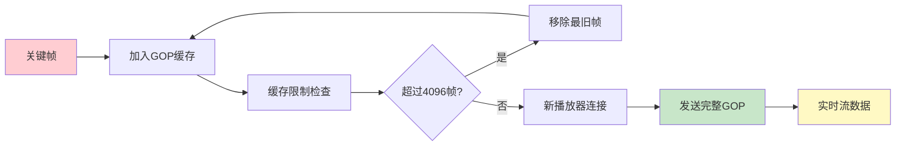

**GOP缓存管理代码：**
```javascript
// 在BroadcastServer中管理GOP缓存
broadcastMessage(packet) {
  // ... 其他处理 ...

  if (packet.flags === 3) { // 关键帧
    // 清理现有缓存
    this.flvGopCache?.clear();
    this.rtmpGopCache?.clear();

    // 重新初始化缓存
    this.flvGopCache = new Set();
    this.rtmpGopCache = new Set();
    this.flvGopCache.add(flvMessage);
    this.rtmpGopCache.add(rtmpMessage);
  } else if (packet.flags === 4) { // 普通帧
    // 添加到缓存，检查大小限制
    if (this.flvGopCache?.size < 4096) {
      this.flvGopCache?.add(flvMessage);
      this.rtmpGopCache?.add(rtmpMessage);
    }
  }
}
```

## 播放数据流分析

### 1. 新播放器连接数据流

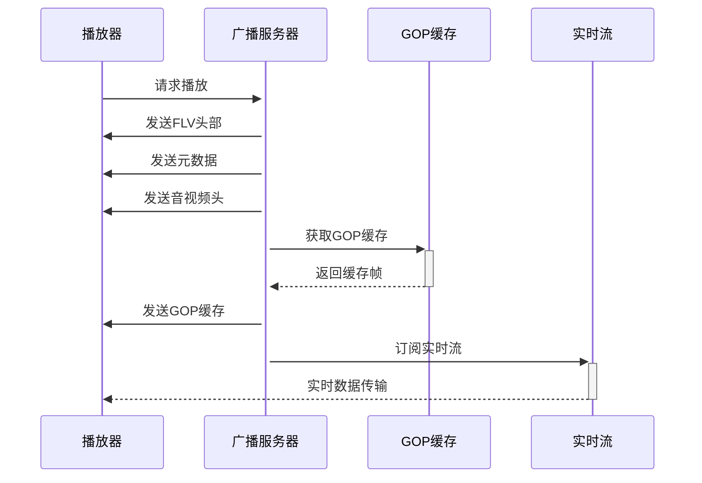

### 2. HTTP-FLV数据流

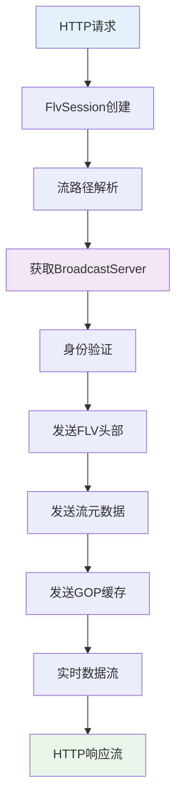

**HTTP-FLV数据发送实现：**
```javascript
// FlvSession中的数据发送
sendBuffer(buffer) {
  if (this.res.writableEnded) {
    return;
  }
  this.res.write(buffer);
  this.outBytes += buffer.length;
}

// 从BroadcastServer接收数据
postPlay(session) {
  // 发送头部信息
  session.sendBuffer(this.flvHeader);
  if (this.flvMetaData !== null) {
    session.sendBuffer(this.flvMetaData);
  }

  // 发送GOP缓存
  if (this.flvGopCache !== null) {
    this.flvGopCache.forEach((frame) => {
      session.sendBuffer(frame);
    });
  }

  // 添加到订阅者列表
  this.subscribers.set(session.id, session);
}
```

### 3. WebSocket-FLV数据流

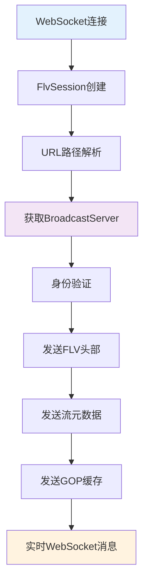

**WebSocket-FLV数据发送实现：**
```javascript
// FlvSession中的WebSocket数据发送
sendBuffer(buffer) {
  if (this.res.readyState !== WebSocket.OPEN) {
    return;
  }
  this.res.send(buffer);
  this.outBytes += buffer.length;
}
```

## 协议转换数据流

### 1. RTMP到FLV转换

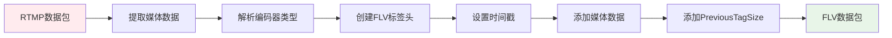

**RTMP到FLV转换代码：**
```javascript
// Flv.createMessage实现
static createMessage(avpacket) {
  const buffer = Buffer.alloc(11 + avpacket.size + 4);

  // FLV标签头
  buffer[0] = avpacket.codec_type;
  buffer.writeUintBE(avpacket.size, 1, 3);          // 数据大小
  buffer.writeUintBE(avpacket.dts & 0x00ffffff, 4, 3); // 时间戳低24位
  buffer[7] = (avpacket.dts >> 24) & 0xff;         // 时间戳扩展
  buffer[8] = 0;  // StreamID (始终为0)
  buffer[9] = 0;
  buffer[10] = 0;

  // 媒体数据
  avpacket.data.copy(buffer, 11, 0, avpacket.size);

  // PreviousTagSize
  buffer.writeUint32BE(11 + avpacket.size, 11 + avpacket.size);

  return buffer;
}
```

### 2. FLV到RTMP转换

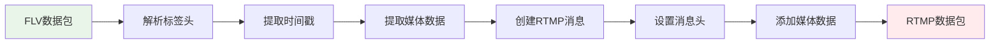

## 元数据处理流程

### 1. 推流端元数据

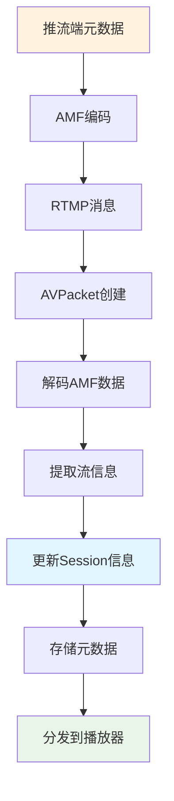

**元数据处理实现：**
```javascript
// BroadcastServer中的元数据处理
if (packet.flags == 5) { // 元数据包
  let metadata = decodeAmf0Data(packet.data);
  if (this.publisher && metadata.cmd === "@setDataFrame") {
    // 提取音频参数
    this.publisher.audioCodec = metadata.dataObj.audiocodecid;
    this.publisher.audioChannels = metadata.dataObj.stereo ? 2 : 1;
    this.publisher.audioSamplerate = metadata.dataObj.audiosamplerate;

    // 提取视频参数
    this.publisher.videoCodec = metadata.dataObj.videocodecid;
    this.publisher.videoWidth = metadata.dataObj.width;
    this.publisher.videoHeight = metadata.dataObj.height;
    this.publisher.videoFramerate = metadata.dataObj.framerate;
  }
}
```

## 统计和监控数据流

### 1. 会话统计数据流

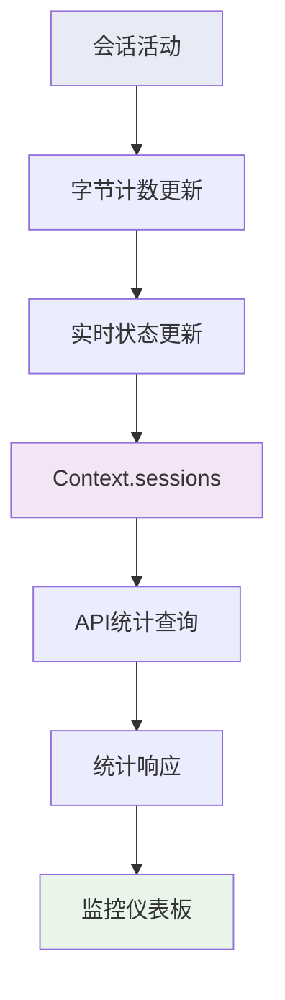

### 2. 系统性能数据流

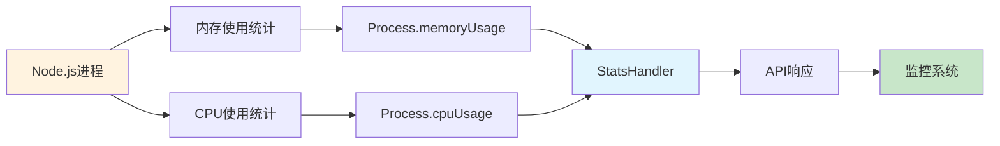

**统计数据处理：**
```javascript
// StatsHandler中的统计收集
getStats() {
  const memoryUsage = process.memoryUsage();
  const cpuUsage = process.cpuUsage();

  // 会话统计
  const totalSessions = Context.sessions.size;
  const publishers = Array.from(Context.sessions.values())
    .filter(s => s.isPublisher).length;
  const players = totalSessions - publishers;

  // 流统计
  const totalStreams = Context.broadcasts.size;
  const activeStreams = Array.from(Context.broadcasts.values())
    .filter(b => b.publisher !== null).length;

  return {
    system: {
      uptime: process.uptime(),
      memory: memoryUsage,
      cpu: cpuUsage
    },
    sessions: {
      total: totalSessions,
      publishers: publishers,
      players: players
    },
    streams: {
      total: totalStreams,
      active: activeStreams
    }
  };
}
```

## 错误处理数据流

### 1. 会话错误处理

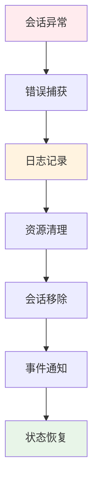

### 2. 协议错误处理

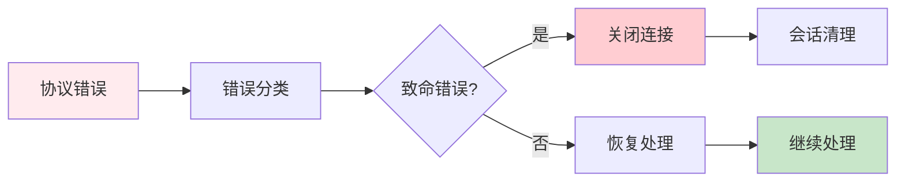

## 数据流优化策略

### 1. 内存优化
- GOP缓存大小限制 (4096帧)
- 及时清理过期会话
- Buffer复用机制

### 2. 网络优化
- 零拷贝数据传输
- TCP_NODELAY设置
- 缓冲区大小优化

### 3. 并发优化
- 事件驱动架构
- 非阻塞I/O
- 负载均衡分发

这个数据流架构确保了Node-Media-Server能够高效处理大规模实时媒体数据，同时保持低延迟和高吞吐量。