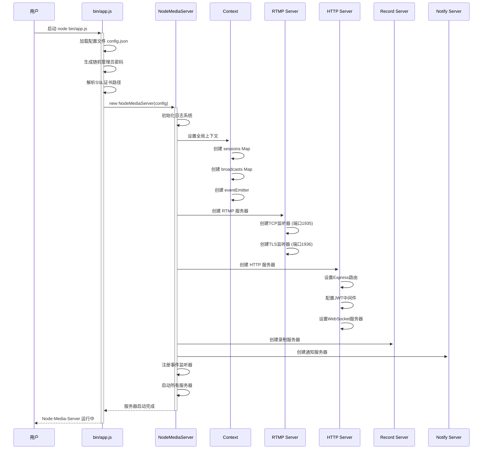
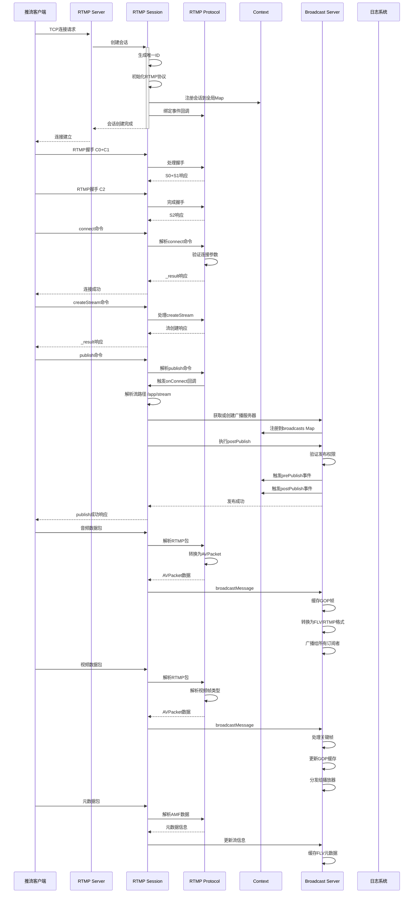
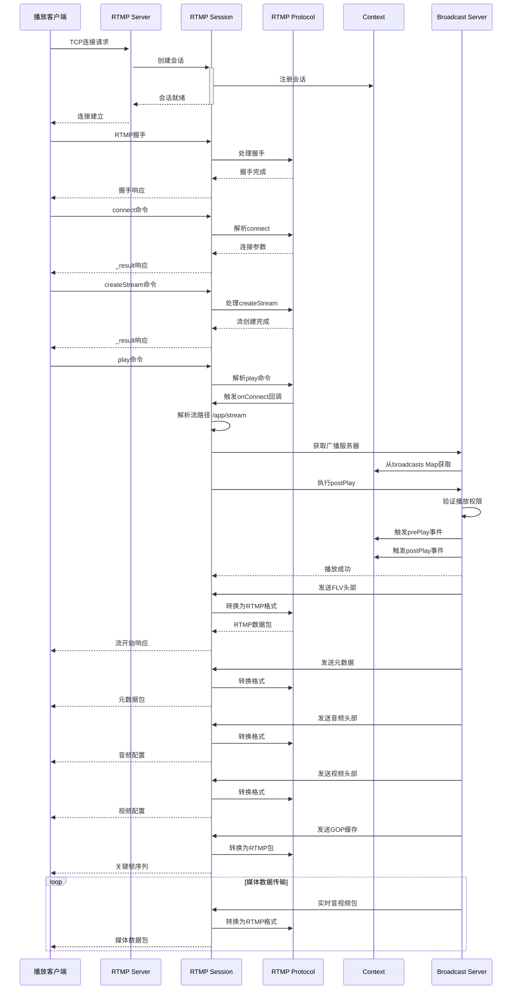
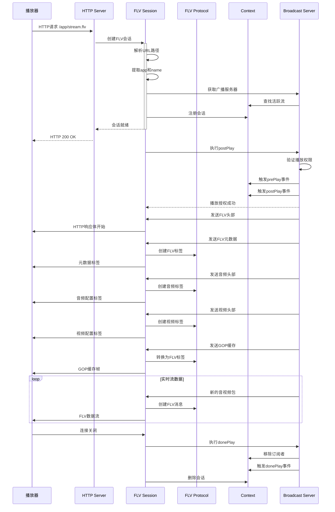
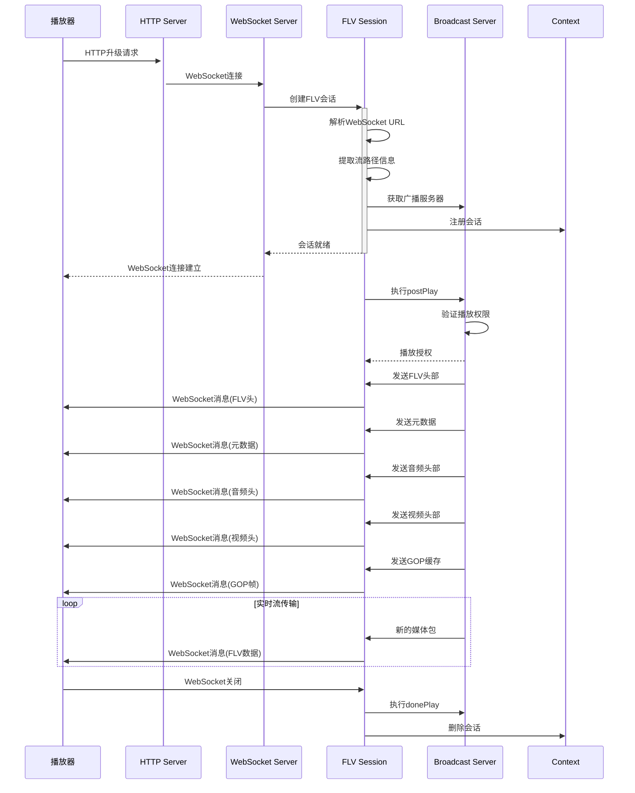
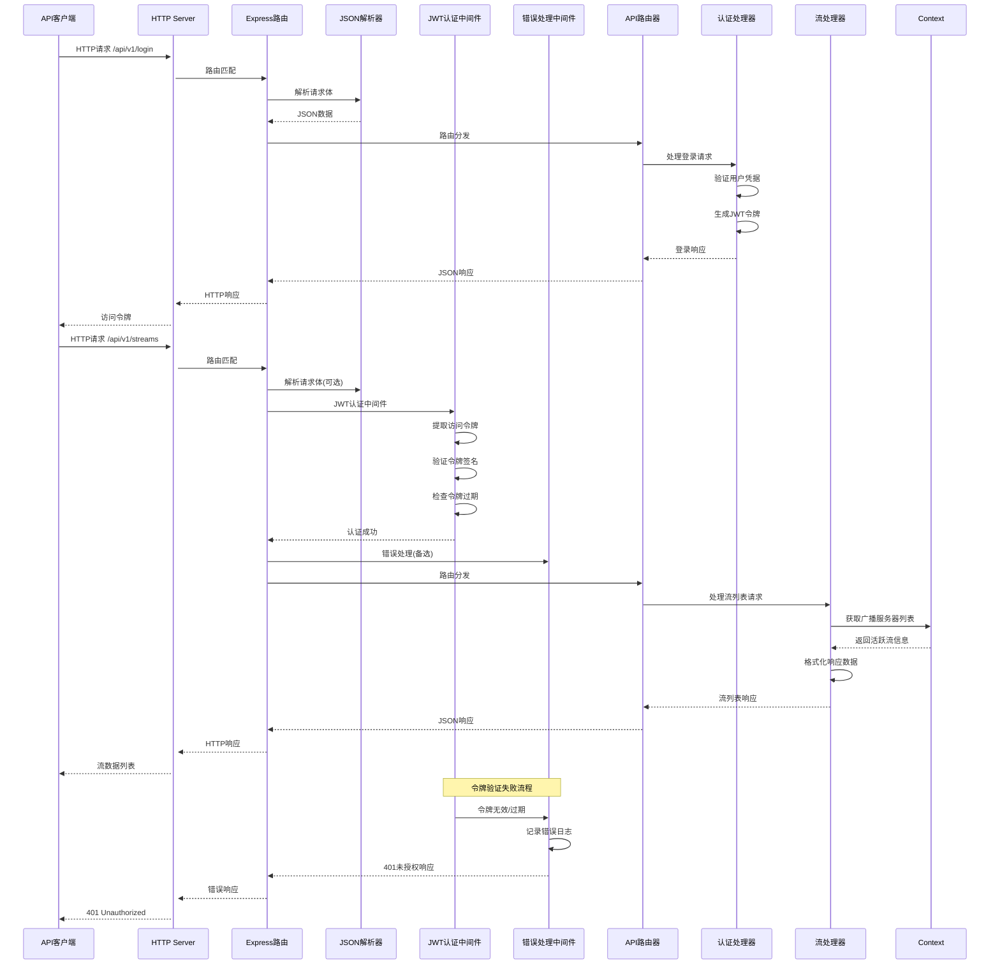
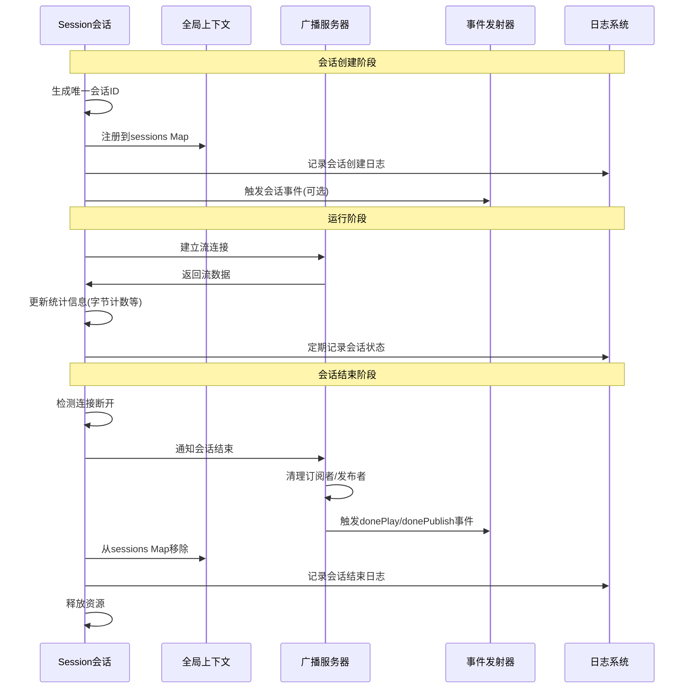

# Node-Media-Server 系统架构时序图

## 1. 服务器启动时序图



## 2. RTMP 推流时序图



## 3. RTMP 播放时序图



## 4. FLV 播放时序图 (HTTP/WebSocket)



## 5. WebSocket-FLV 播放时序图



## 6. API 请求处理时序图



## 7. 多协议流分发时序图

```mermaid
sequenceDiagram
    participant Publisher as RTMP推流端
    participant BroadcastServer as 广播服务器
    participant RtmpPlayer as RTMP播放器
    participant HttpFlvPlayer as HTTP-FLV播放器
    participant WsFlvPlayer as WebSocket-FLV播放器

    Publisher->>+BroadcastServer: 推送RTMP流
    BroadcastServer->>BroadcastServer: 解析媒体包
    BroadcastServer->>BroadcastServer: 生成AVPacket
    BroadcastServer->>BroadcastServer: 缓存GOP帧
    BroadcastServer->>BroadcastServer: 创建FLV格式包
    BroadcastServer->>BroadcastServer: 创建RTMP格式包

    par RTMP播放
        RtmpPlayer->>+BroadcastServer: 请求RTMP播放
        BroadcastServer->>RtmpPlayer: 发送RTMP头部
        BroadcastServer->>RtmpPlayer: 发送RTMP元数据
        loop 实时传输
            BroadcastServer->>RtmpPlayer: RTMP媒体包
        end
        RtmpPlayer-->>-BroadcastServer: 断开连接
    and HTTP-FLV播放
        HttpFlvPlayer->>+BroadcastServer: 请求HTTP-FLV
        BroadcastServer->>HttpFlvPlayer: 发送FLV头部
        BroadcastServer->>HttpFlvPlayer: 发送FLV元数据
        loop 实时传输
            BroadcastServer->>HttpFlvPlayer: FLV媒体包
        end
        HttpFlvPlayer-->>-BroadcastServer: 连接关闭
    and WebSocket-FLV播放
        WsFlvPlayer->>+BroadcastServer: 连接WebSocket-FLV
        BroadcastServer->>WsFlvPlayer: 发送FLV头部
        BroadcastServer->>WsFlvPlayer: 发送FLV元数据
        loop 实时传输
            BroadcastServer->>WsFlvPlayer: FLV媒体包
        end
        WsFlvPlayer-->>-BroadcastServer: WebSocket关闭
    end

    Publisher-->>-BroadcastServer: 停止推流
    BroadcastServer->>BroadcastServer: 清理流数据
    BroadcastServer->>BroadcastServer: 通知所有播放器
```

## 8. 会话生命周期管理时序图

